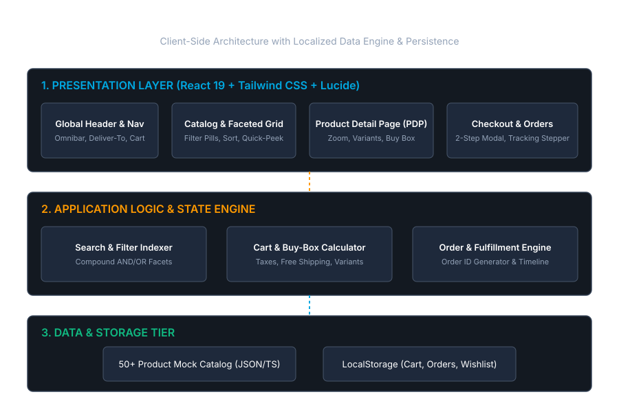

# Amazon Re-imagined ("Amazon Ultra")

> Rebuilding Amazon.com's core retail experience in 24 hours: 10x cleaner, faster, and more transparent.



---

## 🌟 What is Amazon Re-imagined?
Amazon Re-imagined is an engineering rebuild of Amazon.com designed to solve the four biggest flaws in modern e-commerce:
1. **Ad Pollution & Clutter**: Replaces rows of sponsored ads with high-signal, authentic product rankings.
2. **Review Overload**: Introduces **"The Verdict" — AI Review Synthesis** on every PDP, providing an instant executive summary of consensus pros, cons, and buyer recommendations.
3. **Multi-Tab Comparison Chaos**: Features a **1-Click Floating Comparison Dock** that generates a side-by-side spec differential matrix without leaving the catalog.
4. **Friction-Heavy Browsing**: Incorporates an instant **Quick-Peek Slide Drawer**, allowing customers to inspect photos, variants, and stock without losing their search place.
5. **Deceptive Delivery Timelines**: Employs a **Transparent Countdown Buy Box** with real-time delivery estimation (*"Order in 1h 42m for Tomorrow 10 AM"*).
6. **Distraction-Free Checkout**: Replaces the 5-step upsell maze with a clean **2-Step Accordion Checkout** and interactive 4-stage order tracking stepper.

---

## 🚀 Quick Start & Local Development

### Prerequisites
- Node.js 18+ (tested on Node v24)
- npm or pnpm

### Installation
```bash
# Clone the repository
git clone https://github.com/supriyochowdhury760/8x-amazon-rebuild.git
cd 8x-amazon-rebuild

# Install dependencies
npm install

# Start local development server
npm run dev
```
Open [http://localhost:5173](http://localhost:5173) in your browser.

### Production Build & Preview
```bash
# Type check and build optimized bundle
npm run build

# Preview production build locally
npm run preview
```

---

## 📁 Repository Structure
- [`.agent-logs/`](file:///c:/Users/Dange/OneDrive/Desktop/8x/.agent-logs/): Continuous raw prompt-and-response audit logs required by the 8x assignment.
- [`CAPTURE-TEST.md`](file:///c:/Users/Dange/OneDrive/Desktop/8x/CAPTURE-TEST.md): Verification report confirming automated capture hook installation.
- [`docs/`](file:///c:/Users/Dange/OneDrive/Desktop/8x/docs/): Complete enterprise documentation suite (PRD, Architecture, Data Schema, Test Plan, Security, etc.).
- [`data/`](file:///c:/Users/Dange/OneDrive/Desktop/8x/data/): 50+ rich mock products, SQL seed scripts, and sample datasets.
- [`src/`](file:///c:/Users/Dange/OneDrive/Desktop/8x/src/): React 19 + TypeScript application source code.

---

## 🛠️ Tech Stack
- **Framework**: React 19
- **Build Engine**: Vite 6
- **Language**: TypeScript 5
- **Styling**: Tailwind CSS
- **Icons**: Lucide React
- **State & Storage**: React Reactive Store with LocalStorage Persistence
- **Hosting**: Vercel / Cloudflare Pages

---

## 📜 8x Assignment Compliance
- **Automated Logging**: Continuous capture hook configured via [`.agents/hooks.json`](file:///c:/Users/Dange/OneDrive/Desktop/8x/.agents/hooks.json) and [`.agents/capture.py`](file:///c:/Users/Dange/OneDrive/Desktop/8x/.agents/capture.py).
- **Publicly Accessible**: Opens instantly for external evaluators without login.
- **Commit History**: `.agent-logs/` committed progressively throughout the sprint.
