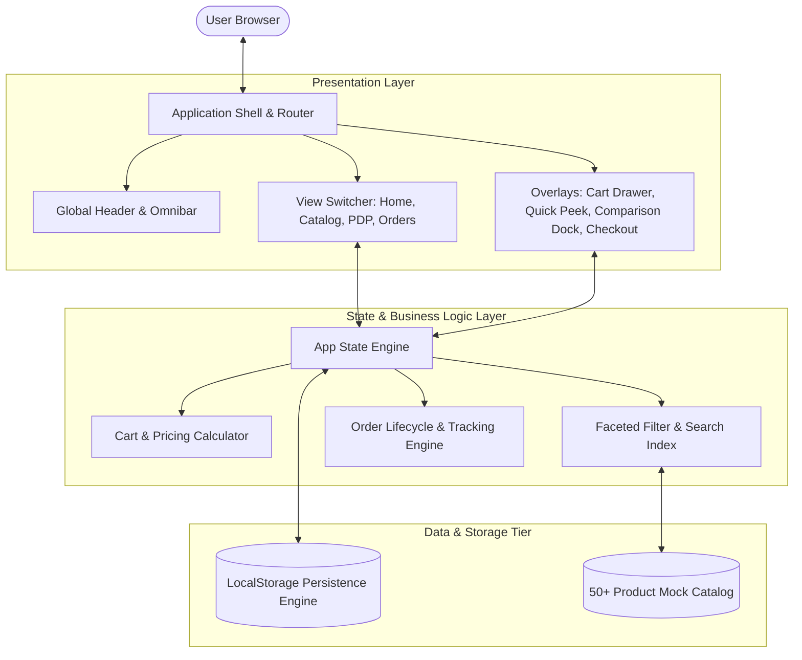

# Technical Architecture — Amazon Re-imagined

## 1. System Overview
Amazon Re-imagined is architected as a modern, high-velocity Single Page Application (SPA) with a resilient client-side state engine and localized data tier. The system delivers sub-second page transitions, zero-latency filtering, and persistent transaction lifecycles without requiring heavy backend servers for the assessment demonstration.

## 2. Component Decomposition
1. **Presentation Layer**: Built with React 19 and Tailwind CSS. Employs atomic component architecture with clear separation between dumb presentational cards and smart connected container views.
2. **State & Logic Engine**: Centralized reactive state store managing cart contents, active filter queries, comparison tray items, and completed order history. All state changes are optimistically reflected in the UI and mirrored to browser storage.
3. **Catalog & Search Engine**: In-memory indexed search engine supporting full-text keyword matching, fuzzy category matching, and compound multi-facet filtering (Department, Prime, Rating, Price Range, In-Stock).
4. **Fulfillment Simulator**: Emulates realistic courier fulfillment with generated tracking numbers, progressive state transitions (Ordered → Processing → In Transit → Delivered), and automated delivery date calculations based on user ZIP codes.
