# Roadmap & Milestones — Amazon Re-imagined

```mermaid
gantt
    title 24-Hour Sprint Roadmap
    dateFormat  HH:mm
    axisFormat %H:%M

    section Phase 0: Setup & Verification
    Agent Capture Hook Verification    :00:00, 30m
    Documentation Architecture Suite   :00:30, 45m

    section Phase 1: Foundation
    Vite + React 19 + Tailwind Scaffolding :01:15, 45m
    50+ Product Mock Catalog Engine        :02:00, 1h

    section Phase 2: Navigation & Home
    Global Header, Subnav & Delivery Modal :03:00, 1h30m
    Hero Carousel & Deals Feed             :04:30, 1h

    section Phase 3: Search & PDP
    Faceted Search, Filters & Pills        :05:30, 1h30m
    Product Detail Page & Buy Box          :07:00, 1h30m
    AI Review Synthesis Card               :08:30, 1h

    section Phase 4: Innovation Layer
    Floating Comparison Dock & Matrix      :09:30, 1h30m
    Quick-Peek Slide Drawer                :11:00, 1h

    section Phase 5: Checkout & Orders
    Cart Drawer & Full Cart View           :12:00, 1h
    2-Step Checkout Accordion              :13:00, 1h30m
    Order Confirmation & Tracking Stepper  :14:30, 1h

    section Phase 6: Polish & Deploy
    Mobile Responsiveness & Micro-animations :15:30, 1h30m
    Vercel Public Deployment & QA            :17:00, 1h
    Video Walkthrough Demo Prep              :18:00, 1h
```

## Milestone Checklist
- [x] **M0: Verification Gate** — `CAPTURE-TEST.md` complete, `.agent-logs/` streaming active.
- [ ] **M1: Core UI Shell** — Global Header, Subnav, Hero Carousel, and Category grid online.
- [ ] **M2: Discovery Engine** — Full-text search with instant category filters, sorting, and pill dismissal.
- [ ] **M3: Product & Review Engine** — PDP with image zoom, variant picker, Buy Box, and AI Review digest.
- [ ] **M4: Power Features** — Side-by-side comparison dock and Quick-Peek drawer functional.
- [ ] **M5: Commerce Loop** — Cart, 2-step checkout, and live order tracking stepper operational.
- [ ] **M6: Live Deployment** — Deployed publicly on Vercel with camera-on walkthrough video recorded.
