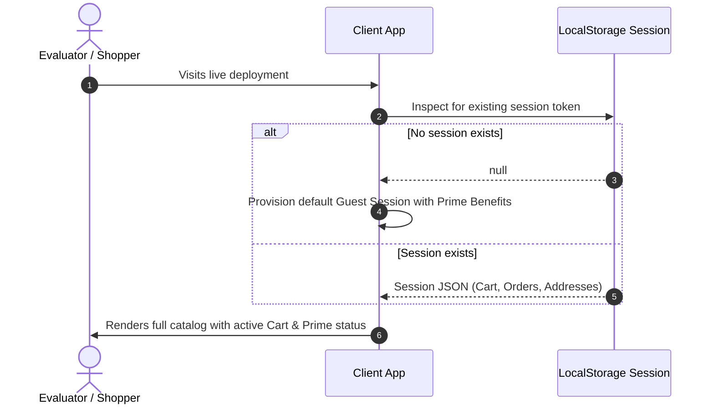

# Authentication & Session Architecture — Amazon Re-imagined

## 1. Zero-Barrier Evaluator Principle
A primary requirement for the 8x assignment is:
> *"The live link opens for somebody who is not signed in as you."*
Hard login gates, password verification roadblocks, or OTP authentication walls would block external evaluators. Therefore, Amazon Re-imagined employs a **Dual-Mode Session Architecture**:
1. **Instant Guest Mode (Default)**: Evaluators can browse, search, configure variants, compare products, add items to cart, and complete full checkouts immediately without entering credentials.
2. **Interactive Identity Switcher**: A lightweight user switcher allows toggling between simulated buyer profiles (`Prime Member: Sarah Connor` vs. `Guest Shopper`) to test personalized behaviors (e.g. Free Prime Shipping badges, saved addresses).

## 2. Session Lifecycle

## 3. Data Integrity & State Isolation
- Simulated session identifiers use cryptographic UUIDs generated via `crypto.randomUUID()`.
- Customer addresses and simulated credit card numbers are stored locally within the browser origin; no personal information is transmitted to external endpoints.
